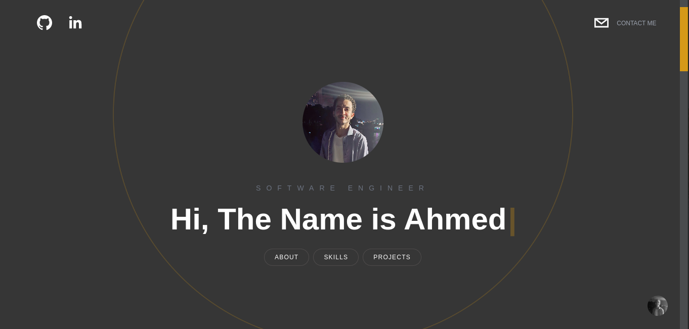

# Modern Portfolio with Reactjs & Nextjs

A **Modern Portfolio** Built with REACT.JS &amp; NEXT.JS.

---

### Used Tools and Technologies

| Tool/Technology                                       | About                                                                                  |
| ----------------------------------------------------- | -------------------------------------------------------------------------------------- |
| [JavaScript](https://www.javascript.com/)             | Programming language                                                                   |
| [TypeScript](https://www.typescriptlang.org/)         | Strongly typed programming language that builds on JavaScript                          |
| [REACT](https://reactjs.org/)                         | JavaScript library for building user interfaces                                        |
| [Next.js](https://nextjs.org/)                        | React-based framework enabling React-based web applications with server-side rendering |
| [Framer Motion](https://www.framer.com/motion/)       | Production-ready motion library for React                                              |
| [Tailwind CSS](https://tailwindcss.com/)              | Open source CSS framework                                                              |
| [GitHub Pages](https://pages.github.com/)             | Hosting service                                                                        |
| [GitHub Actions](https://github.com/features/actions) | (CI/CD) platform                                                                       |

---

## Preview

## 

---

## Live Demo -- > [ahmedfarag9.github.io](https://ahmedfarag9.github.io)

<!--
### Design inspired by [Sonny Sangha](https://www.youtube.com/user/ssangha32)
-->
